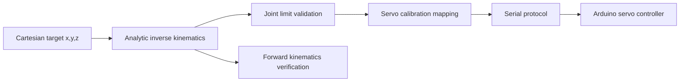

# 3-DOF Robotic Arm

[](https://github.com/vasu4990/3dof-robotic-arm/actions/workflows/python.yml)

A compact 3-DOF robotic-arm reference stack with analytic forward/inverse kinematics, Cartesian waypoint generation, servo calibration/mapping, a CLI, unit tests, and optional Arduino servo receiver firmware.

> **Status:** kinematics/software reference is complete and testable. Link lengths, joint limits, servo offsets, mechanical zero positions, and collision limits must be measured and calibrated on the real arm.

## Kinematic model

The arm is modeled as:

1. Base yaw `q0`
2. Shoulder pitch `q1`
3. Elbow pitch `q2`

with base height `H` and two planar links `L1` and `L2`.



## Install

```bash
python -m venv .venv
# Windows: .venv\Scripts\activate
# Linux/macOS: source .venv/bin/activate
pip install -e .
```

## CLI examples

Solve IK for a point:

```bash
python arm_kinematics.py ik 120 40 90 --l1 100 --l2 100 --base-height 30
```

Verify forward kinematics:

```bash
python arm_kinematics.py fk 15 25 -45 --l1 100 --l2 100 --base-height 30
```

Generate a straight Cartesian path:

```bash
python arm_kinematics.py path 100 0 80 140 30 100 --steps 8
```

## Tests

```bash
pytest -q
```

Tests cover FK↔IK consistency, unreachable targets, path interpolation, and servo calibration behavior.

## Repository layout

```text
.
├── src/arm3dof/
│   ├── kinematics.py
│   ├── trajectory.py
│   ├── servo.py
│   └── cli.py
├── firmware/servo_controller/servo_controller.ino
├── docs/
│   ├── KINEMATICS.md
│   ├── CALIBRATION.md
│   └── SERIAL_PROTOCOL.md
├── tests/
├── arm_kinematics.py
└── pyproject.toml
```

## Hardware integration

The optional Arduino firmware accepts calibrated servo-angle commands such as:

```text
J,90,70,110
```

This means base=90°, shoulder=70°, elbow=110°. The host-side `ServoCalibration` class maps mathematical joint angles to those physical servo commands.

**Do not copy reference offsets into a real arm blindly.** First establish safe mechanical zero positions and joint limits with power/current appropriate for the servos.

## Limitations

This reference model does not include self-collision, payload dynamics, gravity compensation, backlash, flexible links, or trajectory time-parameterization. Those are natural next steps once the physical geometry is known.

## License

MIT — see [`LICENSE`](LICENSE).
