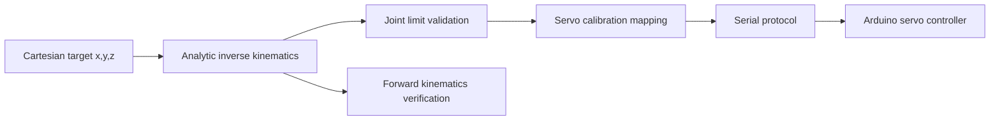

# 3-DOF Robotic Arm

[](https://github.com/VivekVRobo/3dof-robotic-arm/actions/workflows/python.yml)

A compact robotics stack for a desk-scale **3-DOF robotic arm** with analytic forward/inverse kinematics, Cartesian waypoint generation, servo calibration/mapping, a CLI, unit tests, numerical model validation, and optional Arduino servo receiver firmware.

> **Status:** kinematics/software reference is complete and testable. Link lengths, joint limits, servo offsets, mechanical zero positions, and collision limits must be measured and calibrated on the real arm before physical-motion claims are made.

## Project snapshot

| | |
|---|---|
| **Core problem** | Convert Cartesian targets into safe joint commands for a simple student-built robotic arm. |
| **Kinematics** | Analytic FK + IK for base yaw, shoulder pitch and elbow pitch |
| **Motion layer** | Cartesian waypoint interpolation + joint-limit validation |
| **Hardware bridge** | Servo calibration/mapping + serial command protocol + Arduino receiver firmware |
| **Software evidence** | Deterministic FK→IK→FK grid validation + ideal angle-to-endpoint sensitivity analysis |
| **Physical validation tooling** | Interactive endpoint experiment harness with CSV + Markdown error reports |
| **Current maturity** | Software/kinematics reference; physical geometry and calibration remain evidence-gated |
| **Next proof milestone** | Measure the real arm, calibrate servo zero/limits, record repeatable target-reaching tests, and publish visual + numerical results |

## Why this project exists

A robotic-arm demo becomes much more useful when the math, calibration assumptions, hardware protocol and failure limits are visible. This repository keeps those layers explicit so the same code can move from a desktop kinematics reference toward a reproducible physical-arm implementation.

## Kinematic model

The arm is modeled as:

1. Base yaw `q0`
2. Shoulder pitch `q1`
3. Elbow pitch `q2`

with base height `H` and two planar links `L1` and `L2`.



## Install

```bash
python -m venv .venv
# Windows: .venv\Scripts\activate
# Linux/macOS: source .venv/bin/activate
pip install -e .
```

## CLI examples

Solve IK for a point:

```bash
python arm_kinematics.py ik 120 40 90 --l1 100 --l2 100 --base-height 30
```

Verify forward kinematics:

```bash
python arm_kinematics.py fk 15 25 -45 --l1 100 --l2 100 --base-height 30
```

Generate a straight Cartesian path:

```bash
python arm_kinematics.py path 100 0 80 140 30 100 --steps 8
```

## Tests

```bash
pytest -q
```

Tests cover FK↔IK consistency, unreachable targets, path interpolation, servo calibration behavior, deterministic model-grid validation, and endpoint sensitivity calculations.

## Numerical validation without pretending it is hardware evidence

When the physical arm is unavailable, the repository can still produce reproducible **software-only engineering evidence**:

```bash
python tools/numerical_validation.py
```

The default run evaluates a deterministic `17 × 17 × 17` joint-space grid (4,913 reachable poses) through:

```text
joint pose → FK → Cartesian target → IK → FK → reconstruction error
```

It also samples the ideal rigid-link model under small independent joint-angle perturbations and reports the resulting endpoint displacement. This is useful for understanding how angular resolution can geometrically amplify at the tool point.

Output:

```text
artifacts/numerical_validation.json
```

The artifact carries explicit provenance fields:

```text
evidence_type: software_numerical_validation
hardware_evidence: false
```

These results validate the analytic equations and ideal geometric sensitivity only. They **must not** be presented as MG996R accuracy, backlash, repeatability, payload performance, or measured endpoint error.

Example custom run:

```bash
python tools/numerical_validation.py \
  --l1 100 --l2 100 --base-height 30 \
  --grid 21 \
  --angle-perturbation-deg 1.0
```

## Physical validation harness

The repository includes an experiment tool for converting real endpoint measurements into reproducible error metrics:

```bash
python tools/record_physical_experiment.py
```

It prompts for measured `H`, `L1`, and `L2`, prepares 12 guaranteed-reachable kinematic targets, displays the corresponding mathematical joint angles, accepts observed endpoint coordinates, and generates:

```text
artifacts/measured_positions.csv
artifacts/physical_validation_report.md
```

The report calculates mean, median, RMS and maximum Euclidean endpoint error plus per-axis RMSE. A 10–15+ target dataset is recommended before publishing a portfolio-level hardware result.

To test the harness itself without creating fake hardware evidence:

```bash
python tools/record_physical_experiment.py --dry-run
```

Dry-run output is kept under `artifacts/dry_run/` and is explicitly marked as simulated. See [`docs/PHYSICAL_VALIDATION.md`](docs/PHYSICAL_VALIDATION.md) for the measurement protocol, coordinate-frame definition and evidence checklist.

> **No physical error numbers are claimed in this README yet.** The generated physical table should only be promoted here after real measurements, calibration notes and setup evidence exist.

## Repository layout

```text
.
├── src/arm3dof/
│   ├── kinematics.py
│   ├── trajectory.py
│   ├── servo.py
│   ├── validation.py
│   └── cli.py
├── firmware/servo_controller/servo_controller.ino
├── tools/
│   ├── numerical_validation.py
│   └── record_physical_experiment.py
├── docs/
│   ├── KINEMATICS.md
│   ├── CALIBRATION.md
│   ├── SERIAL_PROTOCOL.md
│   └── PHYSICAL_VALIDATION.md
├── experiments/
│   └── PHYSICAL_IK_RUN_TEMPLATE.md
├── tests/
├── arm_kinematics.py
└── pyproject.toml
```

## Hardware integration

The optional Arduino firmware accepts calibrated servo-angle commands such as:

```text
J,90,70,110
```

This means base=90°, shoulder=70°, elbow=110°. The host-side `ServoCalibration` class maps mathematical joint angles to those physical servo commands.

**Do not copy reference offsets into a real arm blindly.** First establish safe mechanical zero positions and joint limits with power/current appropriate for the servos.

## Validation roadmap

### Available now

1. run deterministic FK/IK numerical validation;
2. publish software-only model-consistency artifacts when useful;
3. analyze ideal endpoint sensitivity to joint-angle perturbation;
4. keep all generated results labeled as numerical/simulation evidence.

### When hardware becomes available

1. measure `H`, `L1`, `L2` and mechanical joint limits;
2. calibrate servo zero positions and direction signs;
3. test a set of reachable Cartesian targets;
4. record commanded vs. observed endpoint positions;
5. publish the generated error report and a short motion/setup demo;
6. document backlash, payload and repeatability limitations honestly.

## Contributing

Contributions are welcome for kinematics, calibration, trajectory generation, tests, documentation, visualization and hardware integration. See [`CONTRIBUTING.md`](CONTRIBUTING.md).

## Limitations

This reference model does not include self-collision, payload dynamics, gravity compensation, backlash, flexible links, or trajectory time-parameterization. Numerical angle-sensitivity results assume ideal rigid geometry and are not a substitute for measured servo/mechanical behavior.

## License

MIT — see [`LICENSE`](LICENSE).
