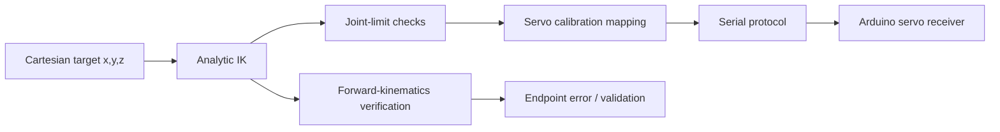

# 3-DOF Robotic Arm

[](https://github.com/VivekVRobo/3dof-robotic-arm/actions/workflows/python.yml)

A compact robotics stack for a desk-scale **3-DOF robotic arm** with analytic forward/inverse kinematics, Cartesian waypoint planning, servo calibration/mapping, serial control, numerical validation, and a physical measurement harness.

> **Evidence boundary:** the kinematics/software stack is testable and numerically validated. Real link geometry, servo zero/limits, backlash, repeatability and endpoint accuracy remain physical-measurement gates and are not claimed here yet.

## See the control path in 30 seconds


```mermaid
flowchart LR
    T[Cartesian target x,y,z] --> IK[Analytic IK]
    IK --> LIMITS[Joint-limit checks]
    LIMITS --> MAP[Servo calibration mapping]
    MAP --> SERIAL[Serial protocol]
    SERIAL --> MCU[Arduino servo receiver]
    IK --> FK[Forward-kinematics verification]
    FK --> ERR[Endpoint error / validation]
```

The project is intentionally split into **math → calibration → command transport → measurement** so a clean software model is never confused with physical robot performance.

## What you can inspect immediately

| Surface | Purpose |
| --- | --- |
| [`arm_kinematics.py`](arm_kinematics.py) | FK, IK and Cartesian path generation |
| [`tools/numerical_validation.py`](tools/numerical_validation.py) | Deterministic model-grid validation |
| [`tools/record_physical_experiment.py`](tools/record_physical_experiment.py) | Real endpoint measurement workflow |
| [`docs/KINEMATICS.md`](docs/KINEMATICS.md) | Kinematic model and assumptions |
| [`docs/CALIBRATION.md`](docs/CALIBRATION.md) | Servo/mechanical calibration process |
| [`docs/PHYSICAL_VALIDATION.md`](docs/PHYSICAL_VALIDATION.md) | Physical evidence protocol |
| [`docs/RELEASE_READINESS.md`](docs/RELEASE_READINESS.md) | First tagged-release gate |

## Project snapshot

| Area | Current state |
| --- | --- |
| Kinematics | Analytic FK + IK for base yaw, shoulder pitch, elbow pitch |
| Planning | Cartesian waypoint interpolation |
| Safety layer | Joint-limit validation before command generation |
| Hardware bridge | Servo calibration/mapping + serial protocol + Arduino receiver |
| Software evidence | Deterministic FK → IK → FK grid validation |
| Physical evidence tooling | Endpoint experiment harness + CSV/Markdown reports |
| Current maturity | Software/kinematics reference |
| Physical endpoint accuracy | Not yet claimed |

## Why this project exists

A robotic-arm demo becomes more useful when the math, calibration assumptions, hardware protocol and failure limits are visible.

This repository is designed so the same code can progress from:

```text
analytic model
      ↓
numerical validation
      ↓
servo calibration
      ↓
physical command path
      ↓
measured endpoint experiments
      ↓
repeatability / backlash evidence
```

without skipping evidence stages.

## Kinematic model

The arm is modeled with:

1. base yaw `q0`
2. shoulder pitch `q1`
3. elbow pitch `q2`
4. base height `H`
5. planar links `L1` and `L2`

## Quick start

Create an environment:

```bash
python -m venv .venv
```

Activate it:

```bash
# Windows
.venv\Scripts\activate

# Linux/macOS
source .venv/bin/activate
```

Install:

```bash
pip install -e .
```

The geometry options are global CLI options, so place them **before** the `ik`, `fk`, or `path` subcommand.

Solve inverse kinematics:

```bash
python arm_kinematics.py --l1 100 --l2 100 --base-height 30 ik 120 40 90
```

Verify forward kinematics:

```bash
python arm_kinematics.py --l1 100 --l2 100 --base-height 30 fk 15 25 -45
```

Generate a straight Cartesian path:

```bash
python arm_kinematics.py --l1 100 --l2 100 --base-height 30 path 100 0 80 140 30 100 --steps 8
```

Run tests:

```bash
pytest -q
```

## Numerical evidence

Run the deterministic model check:

```bash
python tools/numerical_validation.py
```

The default campaign evaluates a `17 × 17 × 17` joint-space grid, giving **4,913 reachable poses**, through:

```text
joint pose → FK → Cartesian target → IK → FK → reconstruction error
```

It also evaluates ideal rigid-link sensitivity under small independent joint-angle perturbations.

The artifact is written to:

```text
artifacts/numerical_validation.json
```

and explicitly carries:

```text
evidence_type: software_numerical_validation
hardware_evidence: false
```

That validates the equations and ideal geometric sensitivity. It does **not** prove MG996R accuracy, backlash, payload capacity or real endpoint repeatability.

## Physical validation path

The physical experiment harness is:

```bash
python tools/record_physical_experiment.py
```

It records measured geometry, prepares reachable targets, accepts observed endpoint coordinates and produces:

```text
artifacts/measured_positions.csv
artifacts/physical_validation_report.md
```

The report calculates mean, median, RMS and maximum Euclidean endpoint error plus per-axis RMSE.

Dry-run mode exists only to validate the harness:

```bash
python tools/record_physical_experiment.py --dry-run
```

Dry-run artifacts are explicitly marked simulated and must not be promoted as physical evidence.

## Evidence maturity

| Claim | Status |
| --- | --- |
| FK/IK implementation | Implemented + tested |
| Numerical FK→IK→FK consistency | Reproducible software evidence |
| Cartesian waypoint generation | Implemented + tested |
| Servo mapping / serial protocol | Implemented |
| Real arm geometry calibration | Pending |
| Real endpoint accuracy | Pending |
| Repeatability/backlash | Pending |
| Payload / physical safety envelope | Not yet claimed |

## First release

A conservative **v0.1.0 software-reference release** is appropriate once the exact release commit passes CI and the checklist in [`docs/RELEASE_READINESS.md`](docs/RELEASE_READINESS.md).

That release may describe the analytic kinematics, CLI, tests, calibration tooling and numerical evidence. It must not include physical-performance claims until the real measurement bundle passes the physical evidence gate.

## Documentation

- [`docs/KINEMATICS.md`](docs/KINEMATICS.md)
- [`docs/CALIBRATION.md`](docs/CALIBRATION.md)
- [`docs/SERIAL_PROTOCOL.md`](docs/SERIAL_PROTOCOL.md)
- [`docs/NUMERICAL_EVIDENCE.md`](docs/NUMERICAL_EVIDENCE.md)
- [`docs/PHYSICAL_VALIDATION.md`](docs/PHYSICAL_VALIDATION.md)

## Contributing

Useful contribution areas include:

- kinematic edge cases;
- calibration tooling;
- Cartesian planning;
- test coverage;
- serial protocol robustness;
- physical measurement workflow;
- visualization and experiment reproducibility.

If the project is useful to your robotics work, **star the repository or follow `VivekVRobo`** to track the physical-validation milestone.

## License

MIT. See [`LICENSE`](LICENSE).
