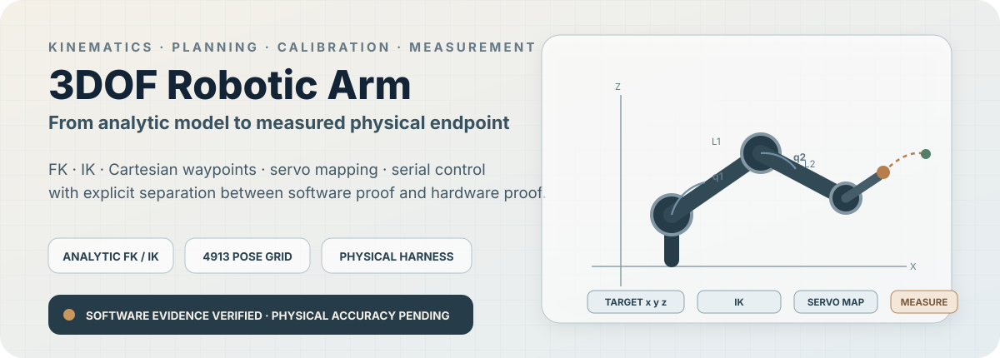
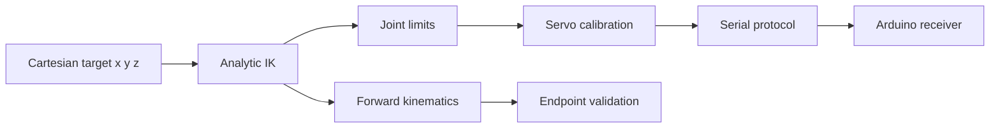

<p align="center">
  
</p>

<p align="center">
  <a href="https://github.com/VivekVRobo/3dof-robotic-arm/actions/workflows/python.yml"></a>
  
  
  
  
</p>

<p align="center">
  <strong>A desk scale 3DOF arm stack that keeps analytic kinematics, calibration, command transport, numerical validation, and physical measurement as separate engineering stages.</strong>
</p>

> [!IMPORTANT]
> **Evidence boundary:** the kinematics and software stack are testable and numerically validated. Real link geometry, servo zero points, backlash, repeatability, endpoint accuracy, payload behavior, and physical safety remain measurement gates and are not claimed yet.

<p align="center">
  <a href="docs/KINEMATICS.md"><strong>Kinematics</strong></a> ·
  <a href="docs/CALIBRATION.md"><strong>Calibration</strong></a> ·
  <a href="docs/NUMERICAL_EVIDENCE.md"><strong>Numerical Evidence</strong></a> ·
  <a href="docs/PHYSICAL_VALIDATION.md"><strong>Physical Validation</strong></a> ·
  <a href="docs/RELEASE_READINESS.md"><strong>Release Gate</strong></a>
</p>

---

## Current Evidence State

| Surface | Evidence | Status |
| --- | --- | :---: |
| **Forward kinematics** | Analytic implementation and tests | ✅ Verified |
| **Inverse kinematics** | Analytic solver and tests | ✅ Verified |
| **FK → IK → FK consistency** | Deterministic joint grid campaign | ✅ Software evidence |
| **Cartesian waypoints** | Interpolation and trajectory tests | ✅ Verified |
| **Joint limit handling** | Validation layer and tests | ✅ Verified |
| **Servo mapping** | Calibration and mapping implementation | ✅ Implemented |
| **Serial command path** | Protocol and Arduino receiver reference | ✅ Implemented |
| **Physical measurement harness** | CSV and report workflow | ✅ Implemented |
| **Mechanical calibration** | Real arm measurement | ◐ Pending |
| **Endpoint accuracy** | Repeated physical measurements | ◐ Pending |
| **Repeatability / backlash** | Physical experiment evidence | ◐ Pending |

---

## Control Path


```mermaid
flowchart LR
    T[Cartesian target x y z] --> IK[Analytic IK]
    IK --> LIMITS[Joint limits]
    LIMITS --> MAP[Servo calibration]
    MAP --> SERIAL[Serial protocol]
    SERIAL --> MCU[Arduino receiver]

    IK --> FK[Forward kinematics]
    FK --> ERR[Endpoint validation]
```

The repository intentionally separates:

```text
analytic model
      ↓
numerical validation
      ↓
servo calibration
      ↓
physical command path
      ↓
measured endpoint experiments
      ↓
repeatability / backlash evidence
```

A clean software model is not treated as proof of physical accuracy.

---

## Numerical Evidence

Run:

```bash
python tools/numerical_validation.py
```

The default deterministic campaign evaluates a **17 × 17 × 17 joint grid**, giving **4,913 sampled poses** through:

```text
joint pose → FK → Cartesian target → IK → FK → reconstruction error
```

The evidence package also characterizes:

* angle sensitivity
* sampled workspace envelope
* position Jacobian conditioning
* near singular configurations

The generated artifact is explicitly software only:

```text
evidence_type: software_numerical_validation
hardware_evidence: false
```

This can validate equations and ideal rigid link behavior. It does not prove servo precision, printed part stiffness, backlash, calibration accuracy, payload capacity, or physical endpoint repeatability.

[**Read numerical evidence methodology →**](docs/NUMERICAL_EVIDENCE.md)

---

## Physical Validation Path

The measurement harness is:

```bash
python tools/record_physical_experiment.py
```

It records measured geometry, prepares reachable targets, accepts observed endpoint coordinates, and produces:

```text
artifacts/measured_positions.csv
artifacts/physical_validation_report.md
```

The report can calculate mean, median, RMS, maximum Euclidean endpoint error, and per axis RMSE once real measurements are entered.

Dry run mode exists only to test the workflow and must not be presented as physical evidence.

[**Read the physical validation protocol →**](docs/PHYSICAL_VALIDATION.md)

---

## Kinematic Model

The arm is modeled with:

* base yaw `q0`
* shoulder pitch `q1`
* elbow pitch `q2`
* base height `H`
* link lengths `L1` and `L2`

The software provides:

* analytic forward kinematics
* analytic inverse kinematics
* reachable workspace checks
* joint limit validation
* Cartesian waypoint generation
* servo calibration and mapping

---

## Quick Start

Create and activate an environment:

```bash
python -m venv .venv
```

Windows:

```powershell
.venv\Scripts\activate
```

Linux / macOS:

```bash
source .venv/bin/activate
```

Install:

```bash
pip install -e .
```

Solve inverse kinematics:

```bash
python arm_kinematics.py --l1 100 --l2 100 --base-height 30 ik 120 40 90
```

Verify forward kinematics:

```bash
python arm_kinematics.py --l1 100 --l2 100 --base-height 30 fk 15 25 -45
```

Generate a Cartesian path:

```bash
python arm_kinematics.py --l1 100 --l2 100 --base-height 30 path 100 0 80 140 30 100 --steps 8
```

Run tests:

```bash
pytest -q
```

---

## Inspect the Implementation

| Surface | Purpose |
| --- | --- |
| [`src/arm3dof/kinematics.py`](src/arm3dof/kinematics.py) | FK and IK |
| [`src/arm3dof/trajectory.py`](src/arm3dof/trajectory.py) | Cartesian planning |
| [`src/arm3dof/servo.py`](src/arm3dof/servo.py) | Servo mapping and calibration |
| [`src/arm3dof/workspace.py`](src/arm3dof/workspace.py) | Workspace validation |
| [`tools/numerical_validation.py`](tools/numerical_validation.py) | Deterministic numerical campaign |
| [`tools/record_physical_experiment.py`](tools/record_physical_experiment.py) | Measurement workflow |
| [`tools/validate_physical_evidence.py`](tools/validate_physical_evidence.py) | Physical evidence validation |

---

## Current Proof Priorities

1. measure real link geometry and mechanical zero positions
2. calibrate servo mapping against real joint angles
3. publish repeated endpoint accuracy measurements
4. quantify repeatability and backlash
5. document payload and physical safety limits only after measurement

---

## Release Status

The first tag should be a conservative **v0.1.0 software reference release**.

It may describe analytic kinematics, planning, calibration tooling, serial control, tests, and numerical evidence.

It must not imply physical endpoint accuracy, repeatability, payload capability, or hardware safety evidence until those measurements exist.

[**Release readiness →**](docs/RELEASE_READINESS.md)

---

## Documentation

* [Kinematics](docs/KINEMATICS.md)
* [Calibration](docs/CALIBRATION.md)
* [Serial Protocol](docs/SERIAL_PROTOCOL.md)
* [Numerical Evidence](docs/NUMERICAL_EVIDENCE.md)
* [Physical Validation](docs/PHYSICAL_VALIDATION.md)

---

## Contributing

Useful work includes kinematic edge cases, calibration tooling, Cartesian planning, serial robustness, visualization, test coverage, and reproducible physical measurement.

---

## License

MIT. See [`LICENSE`](LICENSE).
